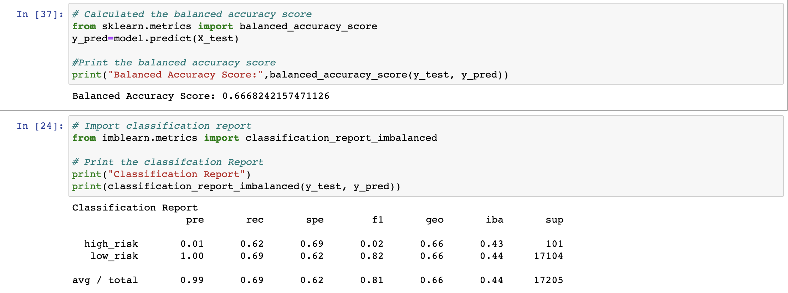

# Credit_Risk_Analysis

## Overview of the analysis: 
The purpose of this analysis was to understand machine learning, using python, and how you can develop a model to predict instances such as credit risk.

Random Over Sampler: This model yieled an accuracy score of 67.43%. The precision was low for the minority class (high risk) at 0.01, while high for the majority class (low risk) at 1.00. The recall was higher for the minority class at 0.74 and a little lower for the minority class at 0.61.

## Results:
- Using the undersampling model, the balanced accuracy score was 54%. The precision low for the minority class was .01, while the high for the majority class was 1.0.

- SMOTE Oversampling method, the balanced accuracy score was 66% and the precision score was (insert)

- Using the Naive Oversampling, the balanced accuracy score was 67% and the precision score was (insert)

- Using the Easy Ensemble model, the balanced accuracy score was 93% and the precision score was (insert)

- Balanced Random Forest method, the balanced accuracy score was 79% and the precision score was (insert)

- Using the Combination Sampling method, the balanced accuracy score was 67% and the precision score was (insert)

## Summary:
The precision for the majority class in all of the models was 1.0. However, the precision for all models for the minority class was very low with the ensemble learners performing slightly better (.09). This indicates for the minor class that there is unreliable positive classification in all models. The recall score for the minority class was the highest for the Easy Ensemble AdaBoost model at 93%. A lower recall score indicates a large number of false negatives. The model I recommend would be the Easy Ensemble AdaBoost model due to having the highest recall, precision, and accuracy score.
